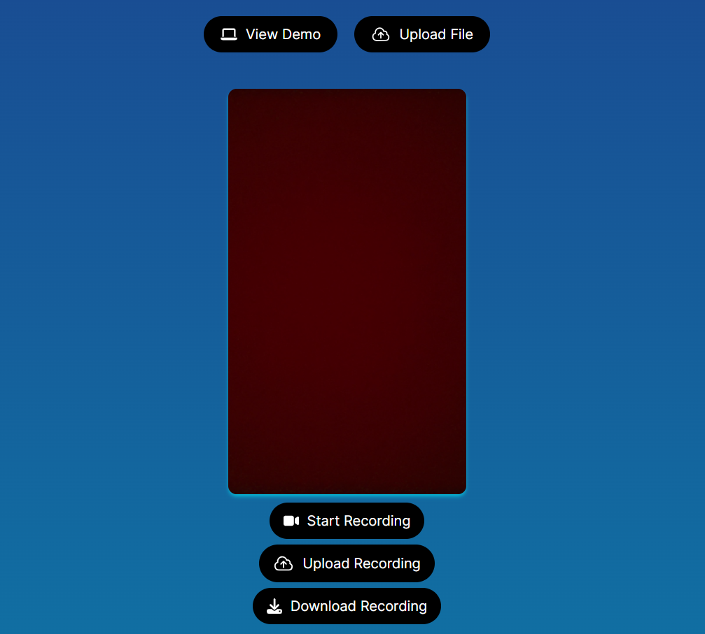

<a name="readme-top"></a>

<!-- PROJECT LOGO -->
<br />
<div align="center">
  <a href="">
    
  </a>

<h2 align="center">LinguaTune: Harmonizing Speech Barriers</h3>

  <p align="center">
    Take your videos to the next level with our state of the art AI platform designed to transcribe vidoes with near-human accuracy. Add captions or voice-over in any language of your choice effortlessly.
  </p>

  <a href=""><h2>Live Demo</h2></a>

</div>


<!-- TABLE OF CONTENTS -->
<details>
  <summary>Table of Contents</summary>
  <ol>
    <li><a href="#about-the-project">About The Project</a></li>
    <li><a href="#major-technologies-used">Major Technologies Used</a></li>
    <li><a href="#installation">Installation</a></li>
    <li><a href="#usage">Usage</a></li>
    <li><a href="#next-steps">Next Steps</a></li>
    <li><a href="#license">License</a></li>
    <li><a href="#contact">Contact</a></li>
    <li><a href="#acknowledgments">Acknowledgments</a></li>
  </ol>
</details>


<!-- ABOUT THE PROJECT -->
## About The Project

The goal of this project was to create a full-stack web application where users could upload or record a video, transcribe it, and provide subtitles or a voice-over in numerous languages. The project is split into three distinct parts:

1. <strong>Upload or Record</strong>: Choose your file of choice to be transcribed by our platform.
    <br>
    - By clicking the <strong>Upload File</strong> button, you can upload a file from your advice.
    
    - By clicking the <strong>Record File</strong> button, your device might prompt you to enable the camera and microphone. After granting access, please reload the page if needed to see the video and audio working. Press the <strong>Start Recording</strong> button, and upon finishing the recording, you have the option to download your recording by pressing the <strong>Download Recording</strong> button or pressing the <strong>Upload Recording</strong> button, which takes you to the next step.
    
   


2. <strong>Select & Edit</strong>: Select a language for transcription and edit for complete accuracy. There is a transcription for Captions and Voice Over, click the one that you'd like to edit.

- <strong>Captions</strong>:
    1. Select the appropriate language for your transcription (01).
    2. Choose the primary and outline color for your subtitles (02).
    3. Modify the transcription in the content section.
    4. Click the <strong>Apply Captions</strong> button, wait for the subtitles to be applied, and view the video for the results.


- <strong>Voice Over</strong>:
    1. Select the appropriate language, gender and person for your transcription (01).
    3. Modify the transcription in the content section.
    4. Click the <strong>Apply Voice Over (Currently in progress)</strong> button, wait for the voice over to be applied, and view the video for the results.


3. <strong>Download:</strong> Download your upgraded video with captions or a voice-over.

    - Click the three vertical buttons at the bottom of video and select <strong>Download</strong> to download your output video.


<p align="right">(<a href="#readme-top">back to top</a>)</p>

<!-- TECHNOLOGIES -->
### Major Technologies Used

[](https://reactjs.org/)
[](https://nextjs.org/)
[](https://tailwindcss.com/)
[](https://aws.amazon.com/sdk-for-javascript/)
[](https://ffmpeg.org/)
[](https://axios-http.com/)
[](https://nodejs.org/)


<p align="right">(<a href="#readme-top">back to top</a>)</p>


## Installation

Please follow instructions below to install and run the project on your local device.


1. Clone the repository.
   ```sh
   git clone https://github.com/mh2rashi/LinguaTune.git
   ```
2. Install NPM packages.
   ```sh
   npm install
   ```

3. Get a free API Key and Bucket Name by signing up with [Amazon Web Services](https://aws.amazon.com/?nc2=h_lg).

4. Enter the following information in the `.env` file.
    ```sh
    AWS_ACCESS_KEY = "Enter key here"
    AWS_SECRET_ACCESS_KEY = "Enter key here"
    BUCKET_NAME = "Enter key here"
    ```
  
5. Run the the development server on your local machine.
    ```sh
    npm run dev
    ```

<p align="right">(<a href="#readme-top">back to top</a>)</p>


## Usage

Please access the [Live Demo](https://stockpeer-3495602137c6.herokuapp.com/) for this project. Wait times for subtitles and voice-over to be applied to the video are subject to its length.

<p align="right">(<a href="#readme-top">back to top</a>)</p>


## Next Steps


- Enhance voice-over transcriptions dynamically by integrating [AWS SSML Tags.](https://docs.aws.amazon.com/polly/latest/dg/supportedtags.html)
- Implement functionality to transcribe multiple voices.
- Integrate features to overlay additional components onto a video, such as GIFs or memes, etc.
- Implement features to merge videos together.
- Add more fonts for subtitles.


<p align="right">(<a href="#readme-top">back to top</a>)</p>


<!-- LICENSE -->
## License

Distributed under the MIT License. See `LICENSE.txt` for more information.

<p align="right">(<a href="#readme-top">back to top</a>)</p>

<!-- CONTACT -->
## Contact

Hamza Rashid

- Email : hamza022697@gmail.com
- LinkedIn: https://www.linkedin.com/in/mhamza-rashid/

<p align="right">(<a href="#readme-top">back to top</a>)</p>


<!-- ACKNOWLEDGMENTS -->
## Acknowledgments

I would like to thank Coding with Dawid for inspiring the [project idea](https://www.youtube.com/watch?v=NPHT51uF1sE&t=14123s), and my heartfelt gratitude goes to my mentor and close friend, Fatima Taj.

<p align="right">(<a href="#readme-top">back to top</a>)</p>

